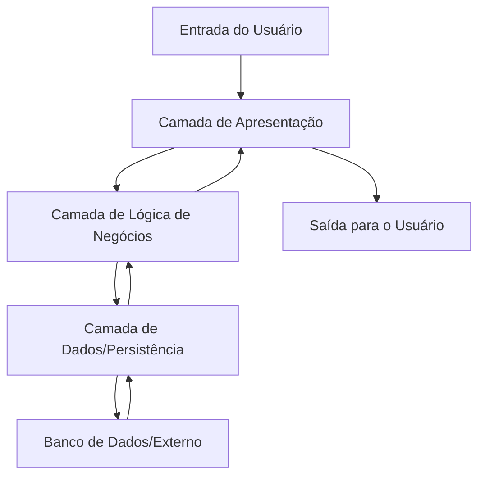
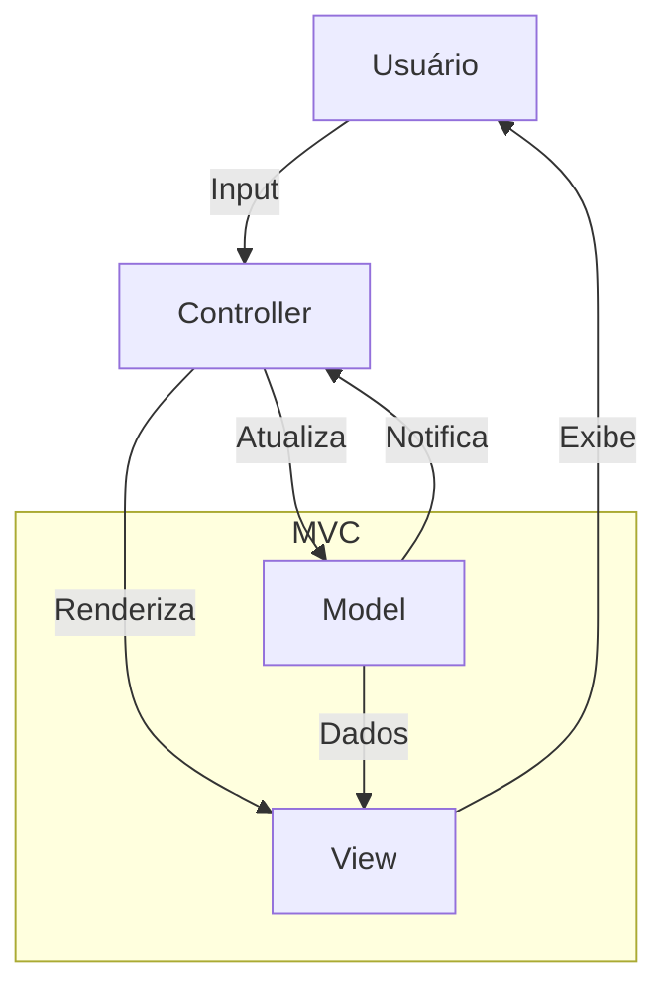
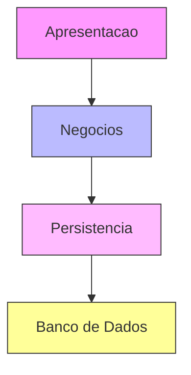
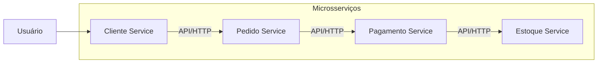
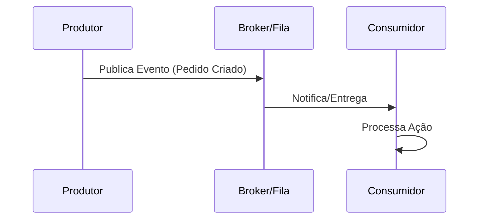
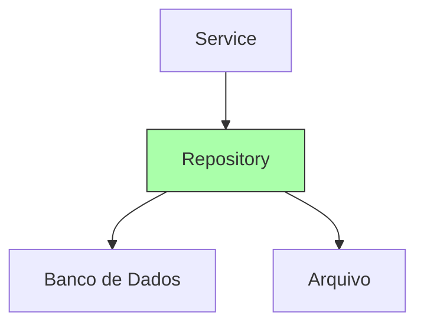
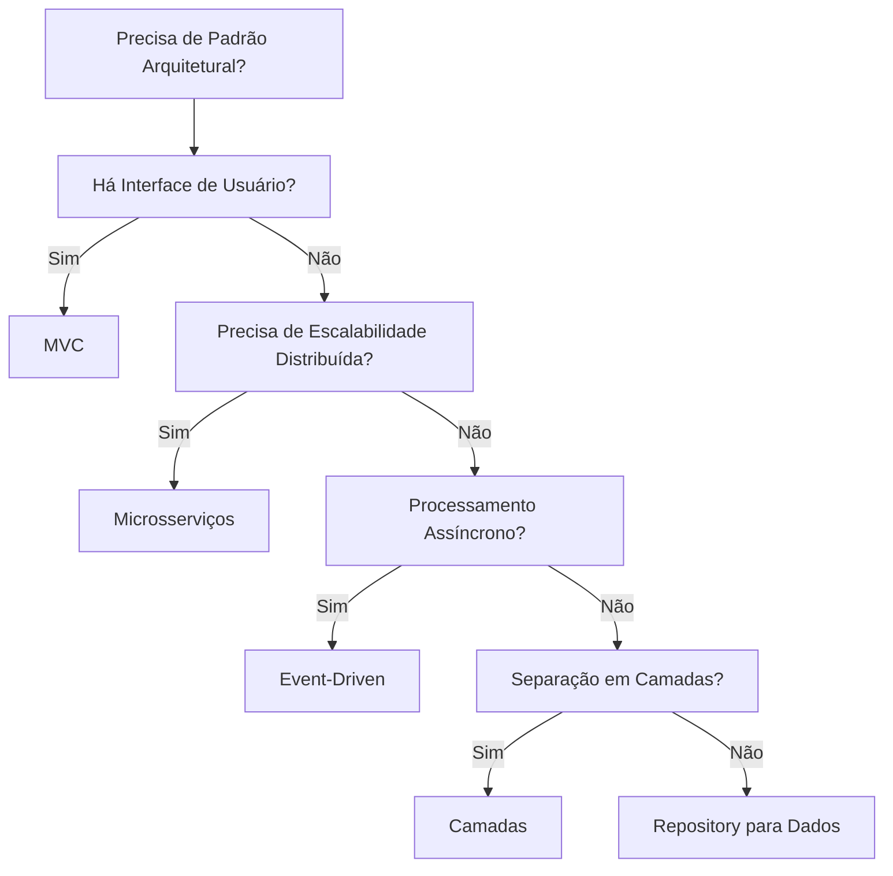

# Padrões Arquiteturais

Padrões arquiteturais são soluções padronizadas e reutilizáveis para problemas comuns na organização de software, promovendo modularidade, manutenibilidade e escalabilidade. Em Python, eles são especialmente úteis devido à flexibilidade da linguagem, permitindo implementações em contextos variados, como aplicações web, scripts de dados ou sistemas distribuídos. Diferem de padrões de design (ex.: Singleton) por atuarem em nível sistêmico, definindo camadas ou fluxos de interação.

**Diagrama: Visão Geral de um Padrão Arquitetural Genérico**  



Aqui, as setas representam fluxos de dados e controle, enfatizando a separação de responsabilidades.

---

## Principais Padrões Arquiteturais Usados em Python


### 1. **MVC (Model-View-Controller)**

**O que é?**  
Divide a aplicação em Model (dados e lógica de negócios), View (interface de usuário) e Controller (mediação entre os dois). O Model gerencia dados; a View exibe e coleta inputs; o Controller processa ações.

**Por que usar?**  
Facilita manutenção ao separar responsabiliades; ideal para interfaces interativas.

>Exemplo completo [aqui](/PDS/mvc/mvc.md)

```python
# models.py (Model)
class Pedido:
    def __init__(self, cliente):
        self.cliente = cliente

# control.py (Controller)
class PedidoController:
    def criar_pedido(self, cliente):
        return Pedido(cliente)

# view.py (View)
class PedidoView:
    def exibir_pedido(self, pedido):
        print(f"Pedido para {pedido.cliente}")

# main.py
controller = PedidoController()
view = PedidoView()
pedido = controller.criar_pedido("Ana Paula")
view.exibir_pedido(pedido)
```

**Diagrama: Fluxo MVC**  
Este diagrama mostra o ciclo de interação no MVC.



Observe como o Controller orquestra o fluxo, evitando acoplamento direto entre Model e View.

### 2. **Camadas (Layered Architecture)**

**O que é?**  
Organiza o sistema em camadas hierárquicas (ex.: Apresentação, Negócios, Persistência), com comunicação apenas entre camadas adjacentes.

**Por que usar?**  
Promove isolamento e testabilidade; fácil substituir camadas.

**Exemplo em Python:**  
Separação em camadas para o seu sistema de pedidos.

```python
# persistence.py (Persistência)
class PedidoRepository:
    def save(self, pedido):
        print("Salvando no BD")

# business.py (Negócios)
class PedidoService:
    def __init__(self, repo):
        self.repo = repo
    def criar_pedido(self, cliente):
        pedido = Pedido(cliente)  # De models.py
        self.repo.save(pedido)

# presentation.py (Apresentação)
class PedidoPresenter:
    def __init__(self, service):
        self.service = service
    def criar(self):
        cliente = input("Cliente: ")
        self.service.criar_pedido(cliente)

# main.py
repo = PedidoRepository()
service = PedidoService(repo)
presenter = PedidoPresenter(service)
presenter.criar()
```

**Diagrama: Estrutura em Camadas**  
Ilustra a pilha hierárquica.



As camadas são empilhadas, com dependências descendentes.

### 3. **Microsserviços**

**O que é?**  
Divide a aplicação em serviços independentes, cada um com sua própria responsabilidade, comunicando-se via APIs.

**Por que usar?**  
Escalabilidade e resiliência; serviços podem ser desenvolvidos/deployados separadamente.

**Exemplo em Python:**  
Um microsserviço para pedidos usando FastAPI.

```python
from fastapi import FastAPI
from pydantic import BaseModel

app = FastAPI()

class Pedido(BaseModel):
    cliente: str

@app.post("/pedidos")
def criar_pedido(pedido: Pedido):
    return {"mensagem": f"Pedido criado para {pedido.cliente}"}
```

**Diagrama: Ecossistema de Microsserviços**  
Mostra serviços interconectados.



Cada caixa é um serviço autônomo; setas indicam chamadas de API.

### 4. **Event-Driven Architecture**

**O que é?**  
Baseia-se em eventos para acionar ações, usando filas ou publicadores/assinantes.

**Por que usar?**  
Desacoplamento e processamento assíncrono.

**Exemplo em Python:**  
Usando uma simulação simples com callbacks (para RabbitMQ real, use `pika`).

```python
# Simples event bus
class EventBus:
    def __init__(self):
        self.listeners = {}
    def subscribe(self, event, callback):
        self.listeners.setdefault(event, []).append(callback)
    def publish(self, event, data):
        for cb in self.listeners.get(event, []):
            cb(data)

bus = EventBus()
def on_pedido_criado(data):
    print(f"Pedido criado: {data['cliente']}")

bus.subscribe("pedido_criado", on_pedido_criado)
bus.publish("pedido_criado", {"cliente": "Ana Paula"})
```

**Diagrama: Fluxo Event-Driven**  
Sequência de eventos.



O broker (ex.: RabbitMQ) media eventos assíncronos.

### 5. **Repository Pattern**

**O que é?**  
Abstrai o acesso a dados em um repositório, isolando a lógica de persistência.

**Por que usar?**  
Facilita testes e mudanças de banco.

**Exemplo em Python:**  
Como no exemplo de camadas.

```python
class PedidoRepository:
    def save(self, pedido):
        # Lógica de BD
        pass

# Uso em service
service = PedidoService(PedidoRepository())
```

**Diagrama: Integração do Repository**  
Mostra abstração.



O Repository atua como facade para fontes de dados.

---

### Comparação e Quando Usar Cada Padrão

Para uma visão comparativa, use a tabela anterior, agora complementada por um diagrama de decisão.

| Padrão          | Melhor para                              | Prós                              | Contras                             |
|-----------------|------------------------------------------|-----------------------------------|-------------------------------------|
| MVC             | Apps com UI                              | Separação clara                   | Complexidade inicial                |
| Camadas         | Sistemas complexos                       | Modularidade                      | Overhead                            |
| Microsserviços  | Distribuídos                             | Escalabilidade                    | Gerenciamento                       |
| Event-Driven    | Assíncronos                              | Desacoplamento                    | Depuração                           |
| Repository      | Acesso a dados                           | Abstração                         | Camada extra                        |

**Diagrama: Árvore de Decisão para Escolha de Padrão**  
Ajuda a decidir baseado em necessidades.




