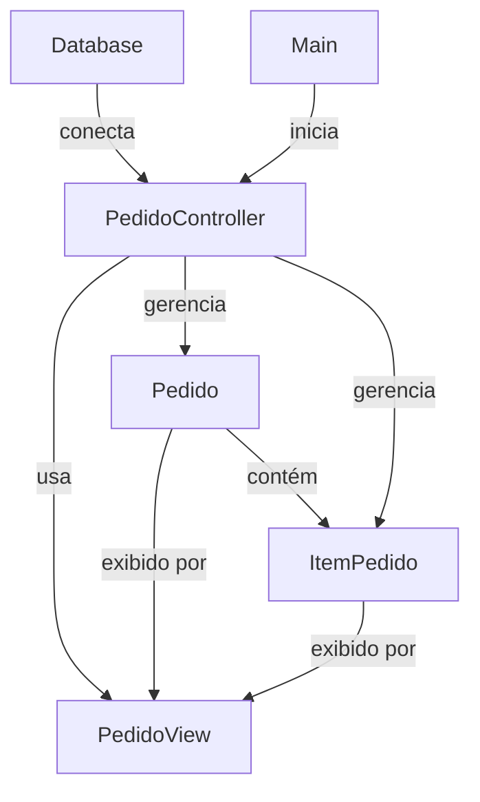

# Visão Geral da Arquitetura

A aplicação gerencia pedidos (`Pedidos`) e seus itens (`ItemPedidos`) em um banco de dados MySQL. Ela segue o padrão **MVC**:

- **Modelo (Model)**: Representa os dados e o esquema do banco (`pedido.py`, `item_pedido.py`, `base.py`).
- **Visão (View)**: Responsável pela apresentação dos dados ao usuário (`pedido_view.py`).
- **Controlador (Controller)**: Gerencia a lógica de negócios e coordena modelo e visão (`pedido_controller.py`).
- **Configuração**: Define a conexão com o banco de dados (`database.py`).
- **Script Principal**: Orquestra a execução da aplicação (`main.py`).

O sistema utiliza **SQLAlchemy**, uma biblioteca ORM (Mapeamento Objeto-Relacional), para interagir com o banco de dados, que contém duas tabelas: `pedido` (pedidos) e `item_pedido` (itens de pedidos), com uma relação de um-para-muitos.

## Arquivos

1. **base.py**:
   - Define a classe base para os modelos SQLAlchemy usando `declarative_base()`.
   - Todos os modelos (`Pedido` e `ItemPedido`) herdam dessa classe `Base` para mapear tabelas do banco.

2. **database.py**:
   - Configura a conexão com o banco de dados MySQL usando `create_engine`.
   - Cria uma fábrica de sessões (`SessionLocal`) para gerenciar transações.
   - Configura o log do SQLAlchemy para reduzir verbosidade e usa `AUTOCOMMIT` para simplificar transações.

3. **pedido.py**:
   - Define o modelo `Pedido`, correspondente à tabela `pedido`.
   - Colunas: `id` (chave primária), `cliente` (string), `data_pedido` (data, padrão é a data atual).
   - Estabelece uma relação um-para-muitos com `ItemPedido` via o atributo `itens`, com exclusão em cascata.

4. **item_pedido.py**:
   - Define o modelo `ItemPedido`, correspondente à tabela `item_pedido`.
   - Colunas: `id` (chave primária), `pedido_id` (chave estrangeira para `pedido`), `produto` (string), `quantidade` (inteiro), `preco` (decimal).
   - Relaciona-se com `Pedido` via o atributo `pedido`.

5. **pedido_view.py**:
   - Implementa a classe `PedidoView`, responsável por exibir dados ao usuário.
   - Métodos:
     - `exibir_pedidos`: Mostra detalhes dos pedidos, incluindo itens.
     - `exibir_mensagem`: Exibe mensagens de sucesso.
     - `exibir_erro`: Exibe mensagens de erro.

6. **pedido_controller.py**:
   - Implementa a classe `PedidoController`, que gerencia a lógica de negócios.
   - Métodos:
     - `salvar_pedido`: Cria e salva um novo pedido com seus itens.
     - `atualizar_pedido`: Atualiza o cliente ou a data de um pedido existente.
     - `deletar_pedido`: Exclui um pedido por ID.
     - `listar_pedidos_com_itens`: Recupera todos os pedidos com seus itens.
     - `fechar`: Fecha a sessão do banco.
     - Métodos integrados com a visão (`criar_e_salvar_pedido`, `deletar_e_exibir`, `listar_e_exibir`) combinam lógica com saídas visuais.

7. **main.py**:
   - Ponto de entrada da aplicação.
   - Cria as tabelas do banco usando `Base.metadata.create_all`.
   - Demonstra o uso criando um pedido, deletando um pedido (ID 16), listando pedidos e fechando a sessão.

### Funcionamento da Arquitetura

1. **Inicialização**:
   - O `main.py` inicializa o esquema do banco e cria uma instância de `PedidoController`.
   - O controlador cria uma sessão de banco (`SessionLocal`) e uma instância de `PedidoView`.

2. **Criação de Pedido**:
   - O método `criar_e_salvar_pedido` no `PedidoController` recebe o nome do cliente e os dados dos itens.
   - Cria um objeto `Pedido`, popula seus `itens` com objetos `ItemPedido` e os salva no banco.
   - A visão exibe uma mensagem de sucesso ou erro.

3. **Exclusão de Pedido**:
   - O método `deletar_e_exibir` busca um pedido por ID, o exclui e exibe o resultado via visão.

4. **Listagem de Pedidos**:
   - O método `listar_e_exibir` consulta todos os pedidos e seus itens, passando-os para a visão exibir.

5. **Interação com o Banco**:
   - O SQLAlchemy mapeia objetos Python (`Pedido`, `ItemPedido`) para tabelas do banco.
   - A `SessionLocal` gerencia transações, com tratamento de erros para commits e rollbacks.

### Diagramas Mermaid (Graph TD)

#### 1. Diagrama de Estrutura (Relações entre Componentes)

Este diagrama mostra as relações entre os modelos, o controlador e a visão.



#### 2. Diagrama de Fluxo (Criação de Pedido)

Este diagrama ilustra o fluxo do método `criar_e_salvar_pedido`.

```mermaid
graph TD
    A[Main] -->|chama| B[PedidoController.criar_e_salvar_pedido]
    B -->|cria| C[Pedido]
    B -->|cria| D[ItemPedido]
    B -->|adiciona| E[Database]
    E -->|commit| F{Sucesso?}
    F -->|Sim| G[PedidoView.exibir_mensagem]
    G --> H[Console: "Pedido salvo com sucesso!"]
    F -->|Não| I[Database.rollback]
    I --> J[PedidoView.exibir_erro]
    J --> K[Console: "Erro: ..."]
    B -->|refresh| E
```

### Explicação dos Diagramas

- **Diagrama de Estrutura**:
  - Mostra a relação um-para-muitos entre `Pedido` e `ItemPedido`.
  - Ilustra como o `PedidoController` gerencia os modelos e utiliza a `PedidoView` para exibir dados.
  - Representa a conexão do controlador com o banco (`Database`) e a inicialização via `main.py`.
  - Reflete a separação de responsabilidades no padrão MVC.

- **Diagrama de Fluxo**:
  - Descreve o processo de criação de um pedido, desde a chamada em `main.py` até a interação com o banco.
  - Mostra a criação dos objetos `Pedido` e `ItemPedido`, a tentativa de salvar no banco e o tratamento de erros.
  - Inclui a interação com a `PedidoView` para exibir mensagens de sucesso ou erro.

### Conclusão

A aplicação demonstra um design modular e robusto, utilizando o padrão MVC e o SQLAlchemy para gerenciar pedidos e itens em um banco MySQL. A separação de responsabilidades garante manutenibilidade:

- **Modelos** (`pedido.py`, `item_pedido.py`) definem a estrutura de dados.
- **Visão** (`pedido_view.py`) lida com a exibição.
- **Controlador** (`pedido_controller.py`) gerencia a lógica e interações com o banco.
- **Configuração** (`database.py`, `base.py`) estabelece o ambiente.
- **Script principal** (`main.py`) integra todos os componentes.

