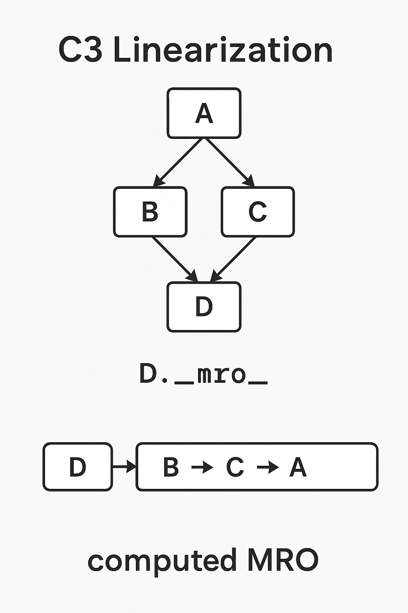

# Herança em Python – Conceitos, Funcionamento e Aplicações

A herança é um pilar fundamental da programação orientada a objetos (POO) em Python, permitindo que uma classe (denominada subclasse ou classe filha) derive características e comportamentos de outra classe (superclasse ou classe pai). Essa mecanismo promove a **reutilização de código**, reduzindo redundâncias e facilitando a manutenção de sistemas complexos. Em essência, a herança estabelece uma relação "é um" (is-a), onde a subclasse herda atributos e métodos da superclasse, podendo estendê-los ou modificá-los.

## Como Funciona a Herança em Python

Tecnicamente, a herança em Python é implementada ao especificar a superclasse entre parênteses na declaração da subclasse, como em `class Subclasse(Superclasse):`. Ao fazer isso, o interpretador Python constrói uma hierarquia de classes, onde a subclasse acessa o namespace da superclasse. Todos os atributos e métodos públicos da superclasse tornam-se disponíveis na subclasse, exceto quando sobrescritos (overriding).

Um aspecto chave é o **Method Resolution Order (MRO)**, uma sequência linear que Python utiliza para resolver conflitos em heranças, especialmente múltiplas. O MRO pode ser inspecionado via `Classe.__mro__`, seguindo uma ordem C3 de linearização para evitar ambiguidades, como no "problema do diamante" (quando duas superclasses derivam de uma comum).

>O C3 linearization é como um “roteiro” que o Python segue para decidir quem responde primeiro quando várias classes podem fornecer o mesmo método. Ele garante que todos os ancestrais sejam visitados uma única vez, na ordem mais lógica possível.

Além disso, o construtor `__init__` da superclasse é invocado explicitamente via `super().__init__()`, permitindo a inicialização de atributos herdados. Atributos de instância (em `self`) são únicos por objeto, enquanto atributos de classe são compartilhados. Em herança múltipla, declarada como `class Subclasse(Super1, Super2):`, o MRO determina a prioridade de resolução.

## Como Deve Ser Utilizada a Herança em Python

A herança deve ser empregada com moderação e intencionalidade, priorizando designs claros e escaláveis. Melhores práticas incluem:

- **Reutilização sem repetição**: Use herança para compartilhar código comum, mas favoreça composição (has-a) sobre herança excessiva para evitar acoplamento rígido.
- **Uso de `super()`**: Sempre invoque métodos da superclasse para permitir extensão cooperativa, especialmente em hierarquias profundas.
- **Evitar herança múltipla desnecessária**: Embora poderosa, ela pode introduzir complexidade; teste o MRO e resolva conflitos explicitamente.
- **Polimorfismo**: Trate subclasses como a superclasse para flexibilidade, como em listas de objetos heterogêneos.
- **Princípios SOLID**: A herança apoia o princípio de substituição de Liskov (subclasses devem ser substituíveis pelas superclasses sem alterar o comportamento esperado).

Armadilhas comuns incluem sobrecarga de hierarquias (levando a código frágil) e sombreamento acidental de atributos. Recomenda-se documentar hierarquias com docstrings e usar testes unitários para validar comportamentos herdados.

##  Generalização  

- É o processo de **abstrair características comuns** de várias classes específicas e agrupá-las em uma **classe mais genérica** (superclasse).  
- Essa superclasse descreve atributos e comportamentos que todas as subclasses compartilham.  
- **Exemplo:** Classes `Carro`, `Moto` e `Caminhão` têm atributos como `cor` e `velocidade`. Ao criar a classe `Veículo`, esses atributos vão para ela.

## Especialização  

- É o caminho inverso: **criar subclasses** a partir de uma classe genérica para **adicionar ou modificar comportamentos** específicos.  
- Cada subclasse herda as características da superclasse, mas também define as suas próprias.  
- **Exemplo:** A partir de `Veículo`, criar `Carro` com `número de portas` ou `Moto` com `cilindrada`.

## Exemplo

```text

                  [Veiculo]          ← Generalização (características comuns)
               ┌────────────┐
               │ cor        │
               │ velocidade │
               │ acelerar() │
               │ frear()    │
               │ info()     │
               └─────┬──────┘
                      │
                      │
     ┌──────────┬─────┴───────┬──────────┐ ← Especialização (caract. específicas)
     │          │             │          │
 [Carro]    [Moto]        [Caminhao]  [Onibus]
 portas     cilindrada     carga_max   assentos
 acelerar() acelerar()     frear()     info()
```

```python

class Veiculo:
    def __init__(self, cor: str):
        self.cor = cor
        self.velocidade = 0

    def acelerar(self, delta: int = 10):
        self.velocidade += delta
        print(f"{self.__class__.__name__} acelerou para {self.velocidade} km/h")

    def frear(self, delta: int = 10):
        self.velocidade = max(0, self.velocidade - delta)
        print(f"{self.__class__.__name__} reduziu para {self.velocidade} km/h")

    def info(self) -> str:
        return f"{self.__class__.__name__}(cor={self.cor}, velocidade={self.velocidade})"


class Carro(Veiculo):
    def __init__(self, cor: str, portas: int = 4):
        super().__init__(cor)
        self.portas = portas

    def info(self) -> str:  # especialização via sobrescrita
        base = super().info()
        return f"{base}, portas={self.portas}"


class Moto(Veiculo):
    def __init__(self, cor: str, cilindrada: int):
        super().__init__(cor)
        self.cilindrada = cilindrada

    def acelerar(self, delta: int = 15):  # motos aceleram “mais rápido” por padrão
        super().acelerar(delta)

    def info(self) -> str:
        base = super().info()
        return f"{base}, cilindrada={self.cilindrada}cc"


class Caminhao(Veiculo):
    def __init__(self, cor: str, carga_max: float):
        super().__init__(cor)
        self.carga_max = carga_max
        self.carga = 0.0

    def carregar(self, peso: float):
        if self.carga + peso > self.carga_max:
            raise ValueError("Excede a carga máxima")
        self.carga += peso

    def frear(self, delta: int = 8):  # freia “mais devagar”
        super().frear(delta)

    def info(self) -> str:
        base = super().info()
        return f"{base}, carga={self.carga}/{self.carga_max} t"
```

## O que é `super()`

O `super()` cria um **objeto especial** que sabe procurar, na **ordem de resolução de métodos** (*MRO – Method Resolution Order*), qual é o **próximo método** a ser chamado a partir da classe atual.

- **Sem `super()`:** você chamaria diretamente `ClasseBase.metodo(self)`.
- **Com `super()`:** você deixa o Python decidir para quem passar o “bastão”, respeitando a MRO — muito útil quando existe **herança múltipla** e mixins.

### MRO (Ordem de Resolução)

O Python percorre as classes na MRO quando busca um método/atributo. Exemplo:

```python
class A:
    def falar(self):
        print("A")

class B(A):
    def falar(self):
        print("B")
        super().falar()

class C(A):
    def falar(self):
        print("C")
        super().falar()

class D(B, C):
    def falar(self):
        print("D")
        super().falar()

print(D.__mro__)  # Mostra a sequência da MRO

D().falar()
```

**Saída:**

```text
D
B
C
A
```



Ou seja:

1. Começa em `D`.
2. Vai para `B`.
3. Depois `C`.
4. Finalmente `A`.
5. Para em `object` (o topo).

Cada `super().falar()` chama **o próximo** na MRO, não “o pai direto”.

### Por que não usar o nome da classe diretamente?

Imagine que você tem herança múltipla. Se você chamar `ClasseBase.metodo(self)`, **pula** outros métodos no caminho.  
Com `super()`, todos os métodos cooperativos na cadeia são executados, uma única vez.

### Uso típico no `__init__`

```python
class Veiculo:
    def __init__(self, marca):
        print("Init Veiculo")
        self.marca = marca

class Carro(Veiculo):
    def __init__(self, marca, portas):
        print("Init Carro")
        super().__init__(marca)
        self.portas = portas

Carro("Fiat", 4)
```

Saída:

```text
Init Carro
Init Veiculo
```

>📌 Aqui, `super()` garante que a inicialização de `Veiculo` também aconteça.

### Regra de ouro para usar `super()`

- Sempre chame `super()` em métodos de **classes que participam de herança múltipla**.
- Tenha assinaturas compatíveis (`*args, **kwargs`) quando várias classes chamarem o mesmo método.
- Não confunda: `super()` **não** chama a classe “mãe direta”, e sim a **próxima na MRO**.

## Sobrescrita e Sobrecarga

### Sobrescrita (*override*)

É **substituir** um método herdado de uma classe base por uma nova implementação na subclasse.

- **Quando acontece:** na **herança**.
- **Objetivo:** alterar ou especializar o comportamento original.
- **Regras:** a subclasse define um método com **mesmo nome** (e normalmente mesma assinatura) do método da classe mãe.
- **No Python:** funciona naturalmente; o método da subclasse “ganha” na MRO.

💡 **Exemplo:**

```python
class Animal:
    def falar(self):
        print("O animal faz um som.")

class Cachorro(Animal):
    def falar(self):  # Sobrescrita
        print("Au au!")

Animal().falar()    # O animal faz um som.
Cachorro().falar()  # Au au!
```

### Sobrecarga (*overload*)

É **ter vários métodos com o mesmo nome, mas assinaturas diferentes** (número/tipo de parâmetros distintos), e o compilador escolhe qual chamar com base nos argumentos.

- **Quando acontece:** em linguagens como Java ou C++ isso é suportado nativamente.
- **Objetivo:** oferecer variações de uso de um mesmo método.
- **No Python:** **não existe sobrecarga verdadeira**.  
  Se você declarar duas funções/métodos com o mesmo nome numa mesma classe, a última definição substitui a anterior.

**Como lidar no Python:**  
Se quiser “simular” sobrecarga, usa-se:

- Valores padrão nos parâmetros.
- `*args` e `**kwargs` para aceitar diferentes formas de chamada.
- Módulo `functools.singledispatch` para funções com comportamento diferente baseado no tipo.

**Exemplo simulando sobrecarga:**

```python
class Calculadora:
    def soma(self, a, b=0, c=0):
        return a + b + c

calc = Calculadora()
print(calc.soma(2, 3))       # 5
print(calc.soma(2, 3, 4))    # 9
print(calc.soma(5))          # 5
```

### Resumo rápido

| Conceito       | Ligado à herança? | Mesmo nome, assinatura diferente? | Suporte nativo no Python? |
|----------------|-------------------|------------------------------------|---------------------------|
| **Sobrescrita**| Sim               | Normalmente mesma assinatura       | ✅ Sim                    |
| **Sobrecarga** | Não               | Sim                                | ❌ Não (apenas simulação) |

## Herança múltipla

É quando uma classe herda **de mais de uma classe ao mesmo tempo**, combinando comportamentos e atributos de todas elas.

>💡 **Analogia rápida:** imagine que você quer criar um “super-herói” que herda os poderes do **Superman** e do **Homem-Aranha**. Ele teria **força** e **visão de calor** de um, e **teias** e **agilidade** do outro.

No Python, você declara herança múltipla colocando todas as classes-base entre parênteses, separadas por vírgula:

```python
class ClasseFilha(ClasseBase1, ClasseBase2, ...):
    ...
```

O Python combina tudo, seguindo a **ordem de resolução de métodos** (*MRO — Method Resolution Order*), que define onde ele procura um método/atributo primeiro.

## Mixins

Um **mixin** é uma classe criada para fornecer **funcionalidades extras** a outras classes, **sem** representar, por si só, um tipo “completo” na hierarquia.  
Ela **não** é usada sozinha — é pensada para ser herdada junto de uma classe “principal” para adicionar comportamento.

>💡 Pense num *mixin* como um **módulo de habilidade** que você encaixa numa classe, tipo um “plugin”.  
>Por exemplo: você tem um personagem de jogo, e quer que ele possa **salvar dados em JSON**. Ao invés de colocar isso direto em todas as classes de personagens, cria um `SalvaJSONMixin` e herda onde precisar.

## Regras de ouro para mixins

- **Nome claro:** geralmente termina com `Mixin` para deixar óbvio o propósito.
- **Focado:** deve oferecer **uma** funcionalidade específica, não um conjunto gigante de coisas.
- **Não** deve ter estado próprio complexo (*não guardar muitos atributos*).
- É usado junto a outras classes, muitas vezes em **herança múltipla**.
- Quase sempre usa `super()` para cooperar bem na cadeia de herança.

### Exemplo

```python
import json

class SalvaJSONMixin:
    def salvar_json(self, caminho):
        with open(caminho, "w") as f:
            json.dump(self.__dict__, f)
        print(f"Dados salvos em {caminho}")

class Personagem:
    def __init__(self, nome, nivel):
        self.nome = nome
        self.nivel = nivel

class Heroi(Personagem, SalvaJSONMixin):
    pass

h = Heroi("Link", 5)
h.salvar_json("heroi.json")
```

- `Heroi` herdou de `Personagem` (características principais) **e** de `SalvaJSONMixin` (habilidade extra de salvar em JSON).
- O mixin é **reutilizável** — poderia colocar em várias outras classes.

### Outro exemplo: combinando mixins

```python
class VoadorMixin:
    def mover(self):
        print("Voando pelos céus...")

class NadadorMixin:
    def mover(self):
        print("Nadando nas águas...")

class Animal:
    def mover(self):
        print("Movendo-se no chão.")

class Pato(Animal, VoadorMixin, NadadorMixin):
    pass

p = Pato()
p.mover()  # Vai chamar o mover() do VoadorMixin porque está primeiro na ordem de herança
```

#### Quando usar

- Adicionar **capacidades específicas** a classes sem criar hierarquias confusas.
- Evitar duplicação de código em várias classes não-relacionadas.
- Criar **componentes modulares** e reutilizáveis.

### Exemplo prático

```python
class Voar:
    def mover(self):
        print("Estou voando pelos céus!")

class Nadar:
    def mover(self):
        print("Estou nadando no oceano!")

class Pinguim(Voar, Nadar):
    pass

p = Pinguim()
p.mover()  # Vai usar o mover() da primeira classe na lista: Voar
```

Saída:

```text
Estou voando pelos céus!
```

### Ajustando com `super()` para cooperar

Se quisermos que **ambos** os comportamentos apareçam, usamos `super()` e **assinaturas compatíveis**:

```python
class Voar:
    def mover(self):
        print("Voando...")
        super().mover()

class Nadar:
    def mover(self):
        print("Nadando...")

class Pato(Voar, Nadar):
    def mover(self):
        print("Sou um pato!")
        super().mover()

Pato().mover()
```

Saída:

```text
Sou um pato!
Voando...
Nadando...
```

### Entendendo a ordem (MRO)

```python
print(Pato.__mro__)
# (<class '__main__.Pato'>, <class '__main__.Voar'>, <class '__main__.Nadar'>, <class 'object'>)
```

- Python vai nessa ordem para achar métodos.
- Isso evita chamadas repetidas e garante que todos cooperem se `super()` for usado.


## Exemplos de Herança em Python

Para ilustrar, consideram-se exemplos que modelam cenários reais, com códigos executáveis e saídas observadas.

**Exemplo 1: Modelagem de Animais (Herança Simples)**  
Uma superclasse `Animal` define comportamentos genéricos, enquanto `Cachorro` herda e sobrescreve.

```python
class Animal:
    def fazer_som(self):
        print("Algum som genérico")

class Cachorro(Animal):
    def fazer_som(self):
        print("Au au!")

animal = Animal()
cachorro = Cachorro()

print("Som do Animal:")
animal.fazer_som()

print("Som do Cachorro:")
cachorro.fazer_som()
```

Saída observada:  

```text
Som do Animal:
Algum som genérico
Som do Cachorro:
Au au!
```


**Exemplo 2: Veículos com Extensão (Uso de `super()`)**  
Aqui, `Carro` herda de `Veiculo` e estende o método `acelerar`.

```python
class Veiculo:
    def __init__(self, modelo):
        self.modelo = modelo
        self.velocidade = 0

    def acelerar(self, incremento):
        self.velocidade += incremento
        print(f"Velocidade atual: {self.velocidade} km/h")

class Carro(Veiculo):
    def __init__(self, modelo, cor):
        super().__init__(modelo)
        self.cor = cor

    def acelerar(self, incremento):
        super().acelerar(incremento)
        print(f"O carro {self.modelo} de cor {self.cor} está acelerando!")

carro = Carro("Fusca", "azul")
carro.acelerar(20)
```

Saída observada:  

```text
Velocidade atual: 20 km/h
O carro Fusca de cor azul está acelerando!
```

**Exemplo 3: Herança Múltipla em Veículos Híbridos**  
`Hibrido` herda de `Veiculo` e `Eletrico`, demonstrando MRO.

```python
class Eletrico:
    def carregar_bateria(self):
        print("Carregando bateria...")

class Veiculo:
    def __init__(self, modelo):
        self.modelo = modelo

class Hibrido(Veiculo, Eletrico):
    def __init__(self, modelo):
        super().__init__(modelo)

    def acelerar(self, incremento):
        print(f"Acelerando o {self.modelo}")
        self.carregar_bateria()

hibrido = Hibrido("Prius")
hibrido.acelerar(10)
print(Hibrido.__mro__)
```

Saída observada:  

```text
Acelerando o Prius
Carregando bateria...
(<class '__main__.Hibrido'>, <class '__main__.Veiculo'>, <class '__main__.Eletrico'>, <class 'object'>)
```

**Exemplo 4: Jogo de RPG**  
Em um jogo simples, `Guerreiro` herda de `Personagem` para especializar ataques.

```python
class Personagem:
    def __init__(self, nome, vida):
        self.nome = nome
        self.vida = vida

    def atacar(self):
        print(f"{self.nome} ataca com força básica.")

class Guerreiro(Personagem):
    def __init__(self, nome, vida, arma):
        super().__init__(nome, vida)
        self.arma = arma

    def atacar(self):
        super().atacar()
        print(f"Usando {self.arma} para um golpe poderoso!")

guerreiro = Guerreiro("Arthur", 100, "espada")
guerreiro.atacar()
```

Saída observada:  

```
Arthur ataca com força básica.
Usando espada para um golpe poderoso!
```


